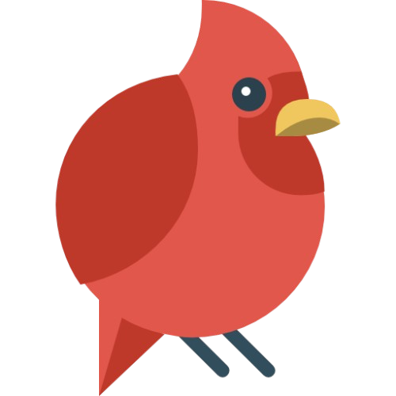
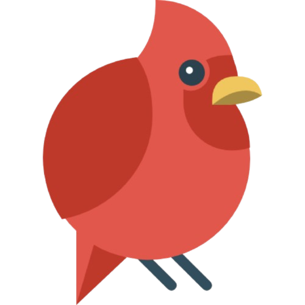

<!DOCTYPE html>
<html lang="en">
  <head>
    <meta charset="UTF-8" />
    <meta name="viewport" content="width=device-width, initial-scale=1.0" />

    <link rel="icon" href="img/logos.png" />

    <!-- Font Lexend Deca -->
    <link rel="preconnect" href="https://fonts.googleapis.com" />
    <link rel="preconnect" href="https://fonts.gstatic.com" crossorigin />
    <link
      href="https://fonts.googleapis.com/css2?family=Michroma&family=Orbitron:wght@400;500;600;700;800;900&display=swap"
      rel="stylesheet"
    />

    <!-- Icon -->
    

    <link rel="stylesheet" href="css/style.css" />
    <title></title>
  </head>
  <body>
    <header>
      

        
        <a href="">Mark Tech Corporation</a>
      

      <nav id="navbar">
        <a href="#">Home</a>
        <a href="#planet">Visi</a>
        <a href="#about">About</a>
        <a href="#contact">Contact</a>
        <a id="login-menu" href="">Log In</a>
        <a id="login-menu" href="">Sign Up</a>
      </nav>

      

        <a href="login.html">Login</a>
        <a id="menu" href="#"><i data-feather="menu"></i></a>
      

    </header>

    <main>
      <section id="hero" class="hero">
        

          <video src="video/earth.mp4" autoplay loop muted></video>

          <article>
            <h2>Mark Tech Corporation</h2>
            

              Mark Tech Corporation adalah, perusahaan yang bergerak di bidang jasa
            

            

            <a href="login.html">Login</a>
          

          </article>
        

      </section>

      <!-- Section Planet -->
      <section class="planet" id="planet">
        

          <h2>Visi</h2>
          

            Menjadi penyedia jasa teknologi terkemuka yang inovatif dan terpercaya,
            memberikan solusi digital terbaik untuk
            mendukung pertumbuhan bisnis dan transformasi digital di era modern.
          

        

        

          

            <video src="video/earth-rotation.mp4" autoplay muted loop></video>
            <!--  -->
          

          <aside class="description">
            <h3>Deskripsi Lengkap</h3>
            

              Mark Tech Corporation adalah perusahaan yang bergerak di bidang jasa,
              berfokus pada solusi teknologi dan digital untuk membantu bisnis 
              dan individu dalam menghadapi tantangan di era modern.
              Dengan tim profesional berpengalaman dan teknologi terkini,
              Mark Tech Corporation berkomitmen untuk memberikan layanan inovatif yang berkualitas tinggi. 
              Mark Tech Corporation hadir untuk mendukung
              transformasi digital dengan layanan yang handal, aman, dan berkelanjutan.
            

            <ul>
              <li>Name Company: Mark Tech Corporation</li>
              <li>Established Since: 2 Februari 2023</li>
              <li>Address: Jakarta.</li>
              <li>Country: Indonesia</li>
              <li>
                Bila ada kritik, saran maupun pertanyaan
                Jangan sungkan-sungkan buat hubungi kami ya dibagian bawah web ini
              </li>
            </ul>
            <a href="#">See More!</a>
          </aside>
        

      </section>

      <!-- Section About -->
      <section class="about" id="about">
        

          <h2>About Us</h2>
          

            Menyediakan layanan teknologi inovatif dan berkualitas tinggi untuk mendukung transformasi digital,
            meningkatkan efisiensi bisnis, serta menciptakan solusi yang berkelanjutan dan bernilai bagi pelanggan.
          

        

        

          

            

              <h5>Platform Interaktif & User-Friendly ( Klik Disini) </h5>
            

            

              

                Dirancang dengan antarmuka yang mudah
                digunakan untuk pengalaman belajar
                yang nyaman dan efektif.
              

            

            

              <a href="#about">Learn More</a>
            

          

          

            

              <h5>Materi Berkualitas & Terupdate ( Klik Disini) </h5>
            

            

              

                Menyediakan konten edukasi berbasis teknologi
                yang selalu diperbarui sesuai dengan
                tren industri dan kebutuhan pasar.
              

            

            

              <a href="#about">Learn More</a>
            

          

          

            

              <h5>Sertifikasi Resmi & Kredibel (Klik Disini) </h5>
            

            

              

                Menawarkan sertifikat yang diakui
                sebagai bukti kompetensi bagi
                peserta yang menyelesaikan kursus.
              

            

            

              <a href="#about">Learn More</a>
            

          

          

            

              <h5>Dukungan Instruktur & Komunitas (Klik Disini) </h5>
            

            

              

                Menyediakan mentor profesional serta 
                forum diskusi untuk meningkatkan
                interaksi dan kolaborasi antar peserta.
              

            

            

              <a href="#about"
                >Learn More</a
              >
            

          

        

      </section>

      <!-- Section Contact -->
      <section class="contact" id="contact">
        

          <h2>CONTACT</h2>
          

            Mark Tech Corporation siap membantu Anda
            dengan solusi terbaik dan layanan profesional.
            Jangan ragu untuk menghubungi kami untuk informasi lebih lanjut!
          

        

        

          <form action="">
            

              

                <label for="name">NAME</label>
                <input spellcheck="false" type="text" id="name" />
              

              

                <label for="email">EMAIL</label>
                <input spellcheck="false" type="text" id="email" />
              

            

            

              <label for="message">MESSAGE</label>
              <textarea spellcheck="false" name="" id="message"></textarea>
            

            

              <input type="submit" value="Kirim Pesan" />
            

          </form>

          

          <aside>
            
          </aside>
        

      </section>
    </main>

    <!-- Footer -->
    <footer id="footer">
      

        <a href="#footer"><i data-feather="instagram"></i></a>
        <a href="#footer"><i data-feather="facebook"></i></a>
        <a href="#footer"><i data-feather="youtube"></i></a>
        <a href="#footer"><i data-feather="twitter"></i></a>
      

      

        
Corporation &copy; 2023

      

    </footer>

    <!-- Js -->
    
    
  </body>
</html>
